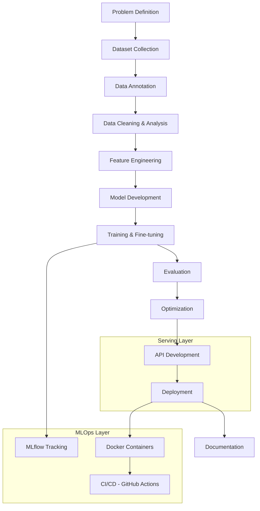

# AI Builders

### Production-Grade AI Engineering, Built in the Open

**We turn AI tutorials into shipped systems.**
A collaborative AI engineering organization building real Computer Vision, LLM, and MLOps systems — from data collection through deployment.

**[Explore Repositories](https://github.com/AI-Builders-Iran)** · **[Leadership Team](#leadership--management)** · **[Join on Telegram](https://t.me/project_realtime)** · **[Contact Us](mailto:aibuildersiran@gmail.com)**

---

## Table of Contents

- [About the Organization](#about-the-organization)
- [Leadership & Management](#leadership--management)
- [Projects](#projects)
- [Technology Stack](#technology-stack)
- [Contribution & Community](#contribution--community)
- [Contact](#contact)

---

## About the Organization

**AI Builders** is an open-source, collaboration-driven AI engineering organization. Our members — students, researchers, and experienced engineers alike — build complete, production-ready systems following the same lifecycle a professional AI engineering team would use: from problem definition and data collection, through model training, evaluation, deployment, and documentation.

We work equally across two core pillars: **production-ready Computer Vision systems** and **LLM / RAG / AI Agent systems** — including retrieval-augmented generation pipelines, agentic workflows, and API-driven inference — alongside active work in deep learning, NLP, and MLOps more broadly.

**Who this organization is for:**

| Audience | Purpose |
|---|---|
| 🛠️ **Engineers** | Contribute to production ML/CV/LLM systems and build a public portfolio |
| 🔬 **Researchers** | A collaborative testbed for applied research |
| 🤝 **Open-source contributors** | Code review experience on real, shipped systems |

---

## Leadership & Management

### 👑 Organizational Leadership

| Member | Title | Responsibilities |
|---|---|---|
| **Amir Mohammad Hatamzadeh** ([@hatamzadeh86](https://github.com/hatamzadeh86)) | Founder of this organization | Sets the organization's vision and direction |
| **Hossein Heydari** ([@HosseinHeydari2004](https://github.com/HosseinHeydari2004)) | Co-Founder, Technical Lead, GitHub Operations Manager | Leads technical direction and GitHub operations; drives repository management and cross-team coordination |

### 🧭 Strategic & Technical Advisory

| Member | Title | Responsibilities |
|---|---|---|
| **Farid Jabari Maleki** ([@faridjb](https://github.com/faridjb)) | Strategic & Technical Advisor | Provides strategic guidance and technical expertise to leadership; contributes to technical decision-making and long-term planning |

### 🛡️ Community Management & Executive Coordination

| Member | Title | Responsibilities |
|---|---|---|
| **Eyna Shabani** ([@Eyna-A](https://github.com/Eyna-A)) | Executive Coordinator & Community Manager | Strategic coordination, executive support, organization operations, issue/PR management, contributor support |

### 🤝 Strategic Partnerships & External Relations

| Member | Title | Responsibilities |
|---|---|---|
| **Mahsa Shadi** ([@Mahsa-Shadi](https://github.com/Mahsa-Shadi)) | Director of Strategic Partnerships | Leads strategic collaborations and partnership negotiations with companies, organizations, universities, and open-source communities |

> The full Core Team roster is maintained in [TEAM.md](https://github.com/AI-Builders-Iran/.github/blob/main/TEAM.md).

---

## Projects

### 🚧 Currently in Progress

#### [DocumentAI](https://github.com/AI-Builders-Iran/DocumentAI)
An enterprise-grade Document AI system combining a document preprocessing pipeline with retrieval-augmented generation (RAG) and LLM-powered AI agents, enabling automated understanding, retrieval, and reasoning over large document collections.
**Tech stack:** Python, RAG, LLMs, AI Agents, FastAPI
**Status:** 🚧 Actively in development

### ✅ Completed & Flagship Projects

#### [Safety Monitoring System](https://github.com/AI-Builders-Iran/IAI-001-Safety-Monitoring-System)
A production-grade Computer Vision + LLM integration reference project. YOLOv8 detection and tracking feed an 8-rule industrial safety Rule Engine (PPE compliance, proximity, idleness, crowd density); events are logged via FastAPI, and a local LLM (Qwen2.5) generates daily/weekly HSE compliance reports in both Persian and English.
**Tech stack:** Python, YOLOv8, FastAPI, OpenCV, Hugging Face Transformers, Gradio, PostgreSQL, Docker, uv
**Status:** ✅ Completed · **License:** MIT

#### [PCB Defect Detection](https://github.com/AI-Builders-Iran/PCB-Defect-Detection)
A two-stage Computer Vision system for detecting, classifying, and tracking assembly defects on PCB boards. A board-segmentation YOLO model crops the PCB region, which a second YOLO model then scans for defects (with ByteTrack multi-frame tracking) — exposed via a FastAPI REST API and a Streamlit dashboard, shipped as a single Docker image.
**Tech stack:** Python, YOLO (Ultralytics), OpenCV, FastAPI, Streamlit, ByteTrack, Docker
**Status:** ✅ Completed · **License:** Not specified in repo

---

## Technology Stack

A typical AI Builders project follows the same engineering lifecycle end-to-end:

| Layer | Technologies |
|---|---|
| **Language** | Python |
| **ML / DL** | PyTorch, TensorFlow, scikit-learn, XGBoost, LightGBM, Optuna |
| **Computer Vision** | OpenCV, Ultralytics, ONNX, OpenVINO |
| **LLM / NLP** | Hugging Face Transformers, LangChain, FAISS, ChromaDB |
| **Backend / API** | FastAPI, REST |
| **MLOps / Deployment** | Docker, MLflow, GitHub Actions, CUDA |
| **Data Science** | Pandas, NumPy, Matplotlib, Plotly |
| **Tooling** | Git, GitHub, Jupyter, VS Code |

---

## Contribution & Community

We operate the way professional AI teams do: through code review, structured feedback, and shared ownership.

**Ways to contribute:**
- Build or improve ML/DL models and CV pipelines
- Create, clean, or annotate datasets
- Build and document APIs
- Review pull requests and write tests
- Improve documentation or onboarding materials
- Conduct applied research
- Fix bugs and optimize performance

**Contribution workflow:**
1. Check open issues or propose a new one describing the problem you want to solve
2. Fork the repository and create a feature branch
3. Follow the coding and documentation standards
4. Open a pull request referencing the relevant issue
5. Address review feedback from a maintainer before merge

Security issues should **not** be filed as public GitHub issues — please report them privately via [aibuildersiran@gmail.com](mailto:aibuildersiran@gmail.com).

---

## Contact

**Organization:** AI Builders
**Founded:** 2026
**Type:** Open-source, community-driven

| Channel | Link |
|---|---|
| GitHub | [github.com/AI-Builders-Iran](https://github.com/AI-Builders-Iran) |
| LinkedIn | [AI Builders](https://www.linkedin.com/company/ai-builders-iran/) |
| Telegram | [t.me/project_realtime](https://t.me/project_realtime) |
| Email | [aibuildersiran@gmail.com](mailto:aibuildersiran@gmail.com) |
| Website | [ai-builders-iran.github.io](https://ai-builders-iran.github.io/) |

**License:** AI Builders has no single org-wide license — licensing is set per repository (see the project list above).

---

**Building intelligent systems. Growing exceptional engineers.**

*"We Build What Others Only Explain"*

