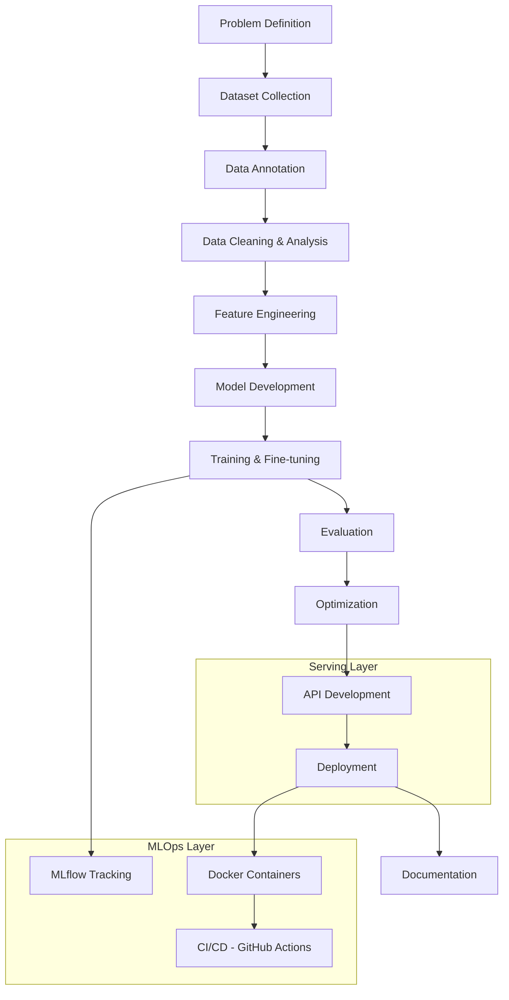

<div align="center">

# AI Builders

### Production-Grade AI Engineering, Built in the Open

**We turn AI tutorials into shipped systems** — a collaborative engineering community building real Computer Vision, LLM, and MLOps products from data collection through deployment.

<p>


</p>


**[Explore Repositories](https://github.com/AI-Builders-Iran)** · **[Meet the Team](https://github.com/AI-Builders-Iran/.github/blob/main/TEAM.md)** · **[Join on Telegram](https://t.me/project_realtime)** · **[Contact Us](mailto:aibuildersiran@gmail.com)**

</div>

---

## Table of Contents

- [Overview & Mission](#overview--mission)
- [Core Repositories & Modules](#core-repositories--modules)
- [Architecture & Technology Stack](#architecture--technology-stack)
- [Getting Started](#getting-started--quick-setup)
- [Community, Governance & Contribution](#community-governance--contribution)
- [Roadmap & Status](#roadmap--status)
- [Contact & License](#contact--license)

---

## Overview & Mission

Most people learn AI through isolated tutorials — a notebook here, a Kaggle competition there — that never encounter the constraints of a real system: messy data, model drift, latency budgets, or a pull request review. **AI Builders exists to close that gap.**

We are an open, collaborative AI engineering community where students, researchers, and developers build complete, production-oriented AI systems together — following the same lifecycle a professional AI team would use, from problem definition to deployment and documentation.

Our primary focus is **production-ready Computer Vision systems integrated with modern AI technologies** (LLMs, retrieval, and API-driven inference), with active work spanning deep learning, NLP, and MLOps more broadly.

Two live examples: **[PCB Defect Detection](https://github.com/AI-Builders-Iran/PCB-Defect-Detection)**, a two-stage YOLO pipeline that catches assembly defects on circuit boards, and **[Safety Monitoring System](https://github.com/AI-Builders-Iran/IAI-001-Safety-Monitoring-System)**, which pairs YOLOv8 detection with a local LLM to turn factory-floor camera feeds into HSE compliance reports — both shipped with REST APIs, dashboards, and Docker deployment. The community's work isn't limited to Computer Vision either: **[Fraud Detection ML](https://github.com/AI-Builders-Iran/fraud-detection-ml)** applies the same end-to-end rigor — EDA, imbalanced-data handling, model comparison, FastAPI serving — to detecting fraudulent credit card transactions. See the [full breakdown below](#core-repositories--modules).

**Who this is for:**
| | |
|---|---|
| 🎓 **Learners** | who want project-based experience beyond tutorials |
| 🛠️ **Engineers** | who want to contribute to production ML/CV systems and build a public portfolio |
| 🔬 **Researchers** | who want a collaborative testbed for applied research |
| 🤝 **Open-source contributors** | who want code review experience on real, shipped systems |

---

## Core Repositories & Modules

| Repository | Description | Tech Stack | License | Status |
|---|---|---|---|---|
| **[PCB Defect Detection](https://github.com/AI-Builders-Iran/PCB-Defect-Detection)** | Two-stage computer vision system for detecting, classifying, and tracking assembly defects on PCB boards. A board-segmentation YOLO model crops the PCB region, which a second YOLO model then scans for defects (with ByteTrack multi-frame tracking) — exposed via a FastAPI REST API and a Streamlit dashboard, shipped as a single Docker image. | Python, YOLO (Ultralytics), OpenCV, FastAPI, Streamlit, ByteTrack, Docker | Not specified in repo | ✅ Active |
| **[Safety Monitoring System](https://github.com/AI-Builders-Iran/IAI-001-Safety-Monitoring-System)** | End-to-end workplace safety monitoring for construction sites, factories, and warehouses. YOLOv8 detection + tracking feeds an 8-rule industrial safety Rule Engine (PPE compliance, proximity, idleness, crowd density), with events stored via FastAPI, a Gradio dashboard, and a local LLM (Qwen2.5) generating daily/weekly HSE reports in Persian and English. | Python, YOLOv8, FastAPI, OpenCV, Hugging Face Transformers, Gradio, PostgreSQL, Docker, uv | MIT | ✅ Active |
| **[Fraud Detection ML](https://github.com/AI-Builders-Iran/fraud-detection-ml)** | End-to-end Machine Learning pipeline for credit card fraud detection: EDA and preprocessing on a highly imbalanced 284K-transaction dataset, model comparison (Logistic Regression, XGBoost, LightGBM), and a production LightGBM model served via a FastAPI real-time prediction endpoint. | Python, Scikit-Learn, XGBoost, LightGBM, Optuna, FastAPI, Pandas, Docker | MIT | ✅ Active |
| `.github` | Organization profile and community health files (this repo) | Markdown | — | ✅ Active |

**Status legend:** ✅ Active & maintained · 🟡 Needs repo link/status · 🔴 Archived

> As AI Builders ships new projects, add them here following the same pattern — each flagship repo should keep its own detailed README (architecture, API docs, setup instructions); this table is the discovery layer that points visitors to them.

---

## Architecture & Technology Stack

A typical AI Builders project follows the same engineering lifecycle end-to-end, with each stage owned by contributors interested in that layer:



**Stack by layer:**

| Layer | Technologies |
|---|---|
| **Language** | Python |
| **ML / DL** | PyTorch, TensorFlow, scikit-learn, XGBoost, LightGBM, Optuna |
| **Computer Vision** | OpenCV, Ultralytics, ONNX, OpenVINO |
| **LLM / NLP** | Hugging Face Transformers, LangChain, FAISS, ChromaDB |
| **Backend / API** | FastAPI, REST |
| **MLOps / Deployment** | Docker, MLflow, GitHub Actions, CUDA |
| **Data Science** | Pandas, NumPy, Matplotlib, Plotly |
| **Tooling** | Git, GitHub, Jupyter, VS Code |

---

## Getting Started & Quick Setup

> The steps below are the general pattern across AI Builders projects. Each flagship repo has its own, more detailed setup guide — see [PCB Defect Detection](https://github.com/AI-Builders-Iran/PCB-Defect-Detection#readme) (Docker Compose, model weight placement, FastAPI + Streamlit), [Safety Monitoring System](https://github.com/AI-Builders-Iran/IAI-001-Safety-Monitoring-System#readme) (GPU/CUDA requirements, `uv` dependency management, Docker Compose with API + Gradio UI), or [Fraud Detection ML](https://github.com/AI-Builders-Iran/fraud-detection-ml#readme) (single FastAPI service, no GPU required) for exact commands.

### Prerequisites

- **Python** 3.10+
- **Git**
- **Docker** (optional, for containerized services)
- **CUDA-capable GPU** (optional, recommended for training/inference workloads)
- API keys for any third-party services used by a given project (e.g., an LLM provider key), set as environment variables

### Setup

```bash
# 1. Clone the repository
git clone https://github.com/AI-Builders-Iran/<repository-name>.git
cd <repository-name>

# 2. Create and activate a virtual environment
python -m venv .venv
source .venv/bin/activate      # Windows: .venv\Scripts\activate

# 3. Install dependencies
pip install -r requirements.txt

# 4. Configure environment variables
cp .env.example .env
# then edit .env with your API keys / config values

# 5. Run the project
python main.py
```

### Running with Docker (if applicable)

```bash
docker build -t ai-builders/<repository-name> .
docker run --env-file .env -p 8000:8000 ai-builders/<repository-name>
```

---

## Community, Governance & Contribution

We build the way professional AI teams do: through code review, structured feedback, and shared ownership.

**Ways to contribute:**
- Build or improve ML/DL models and CV pipelines
- Create, clean, or annotate datasets
- Build and document APIs
- Review pull requests and write tests
- Improve documentation or onboarding materials
- Conduct applied research
- Fix bugs and optimize performance

**Contribution workflow:**
1. Check open issues or propose a new one describing the problem you want to solve
2. Fork the repository and create a feature branch
3. Follow the coding and documentation standards in `CONTRIBUTING.md` *(add link once published)*
4. Open a pull request referencing the relevant issue
5. Address review feedback from a maintainer before merge

| Document | Purpose | Link |
|---|---|---|
| `CONTRIBUTING.md` | Contribution guidelines, branch/PR conventions | *(to be published)* |
| `CODE_OF_CONDUCT.md` | Community behavior standards | *(to be published)* |
| `SECURITY.md` | Responsible disclosure for security vulnerabilities | *(to be published)* |
| `TEAM.md` | Maintainers and organizers | [View Team](https://github.com/AI-Builders-Iran/.github/blob/main/TEAM.md) |

Security issues should **not** be filed as public GitHub issues until a formal disclosure process is published — until then, report privately via [aibuildersiran@gmail.com](mailto:aibuildersiran@gmail.com).

---

## Roadmap & Status

**Current focus:**
- [ ] Publish `CONTRIBUTING.md`, `CODE_OF_CONDUCT.md`, and `SECURITY.md`
- [x] Populate the Core Repositories table with live project links and status — PCB Defect Detection and Safety Monitoring System are live
- [x] Ship the first production-ready Computer Vision + LLM integration reference project — Safety Monitoring System (YOLOv8 + Qwen2.5 HSE reporting)
- [ ] Publish finalized benchmark numbers for the Safety Monitoring System's production model (mAP/precision/recall currently being validated)
- [ ] Stand up basic CI (lint, test, build) via GitHub Actions on flagship repos
- [ ] Add a `LICENSE` file to PCB Defect Detection (currently unspecified)

**Near-term goals:**
- [ ] Launch a project template repo for new contributors to fork
- [ ] Publish the community website (currently "Coming Soon")
- [ ] Establish a lightweight RFC/proposal process for new project ideas

**Longer-term goals:**
- [ ] Participate in open AI competitions and publish write-ups
- [ ] Build a recurring code-review / mentorship track for new contributors
- [ ] Expand into additional applied research domains as the community grows

---

## Contact & License

**Organization:** AI Builders
**Founded:** 2026
**Type:** Open-source, community-driven

| Channel | Link |
|---|---|
| GitHub | [github.com/AI-Builders-Iran](https://github.com/AI-Builders-Iran) |
| LinkedIn | [AI Builders Iran](https://www.linkedin.com/company/ai-builders-iran/) |
| Telegram | [t.me/project_realtime](https://t.me/project_realtime) |
| Email | [aibuildersiran@gmail.com](mailto:aibuildersiran@gmail.com) |
| Website | Coming soon |

**License:** AI Builders has no single org-wide license — licensing is set per repository:

| Repository | License |
|---|---|
| PCB Defect Detection | Not specified — treat as all rights reserved until a `LICENSE` file is added |
| Safety Monitoring System | [MIT](https://github.com/AI-Builders-Iran/IAI-001-Safety-Monitoring-System/blob/main/LICENSE) |
| Fraud Detection ML | [MIT](https://github.com/AI-Builders-Iran/fraud-detection-ml/blob/main/LICENSE) |

*(Maintainers: consider adopting an org-wide default, e.g. MIT or Apache-2.0, for new repositories going forward.)*

<div align="center">

---

**Building intelligent systems. Growing exceptional engineers.**

*"The best way to master AI is to build it together."*

</div>
